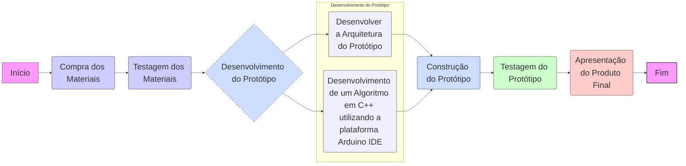

# fluxograma-em-Mermaid

```mermaid
flowchart LR
  classDef largeFont fill:none, font-size:30px;

  subgraph subGraph0["Desenvolvimento do Protótipo"]
    D1("Desenvolver a Arquitetura do Protótipo"):::largeFont
    D2("Desenvolvimento de um Algoritmo em C++ <br> utilizando a plataforma Arduino IDE"):::largeFont
  end

  A["Início"]:::largeFont --> B("Compra dos Materiais"):::largeFont
  B --> C("Testagem dos Materiais"):::largeFont
  C --> D{"Desenvolvimento do Protótipo"}:::largeFont
  D --> D1 & D2
  D1 --> F("Construção do Protótipo"):::largeFont
  D2 --> F
  F --> G("Testagem do Protótipo"):::largeFont
  G --> H("Apresentação do Produto Final"):::largeFont
  H --> I["Fim"]:::largeFont

  style D1 fill:#eef,stroke:#333,stroke-width:1px
  style D2 fill:#eef,stroke:#333,stroke-width:1px
  style A fill:#f9f,stroke:#333,stroke-width:1px
  style B fill:#ccf,stroke:#333,stroke-width:1px
  style C fill:#ccf,stroke:#333,stroke-width:1px
  style D fill:#cdf,stroke:#333,stroke-width:1px,stroke-dasharray: 6 6
  style F fill:#cdf,stroke:#333,stroke-width:1px
  style G fill:#cfc,stroke:#333,stroke-width:1px
  style H fill:#fcc,stroke:#333,stroke-width:1px
  style I fill:#f9f,stroke:#333,stroke-width:2px
```
